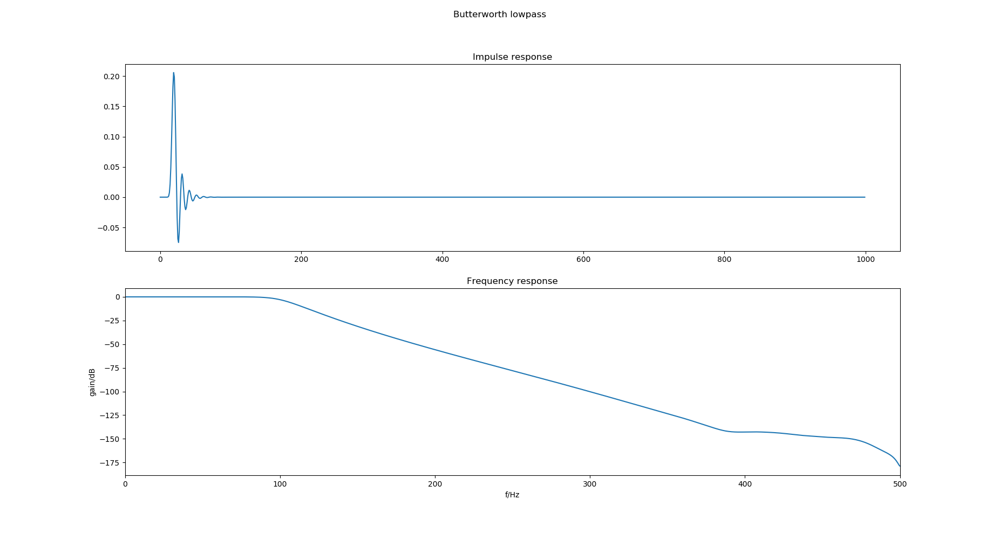
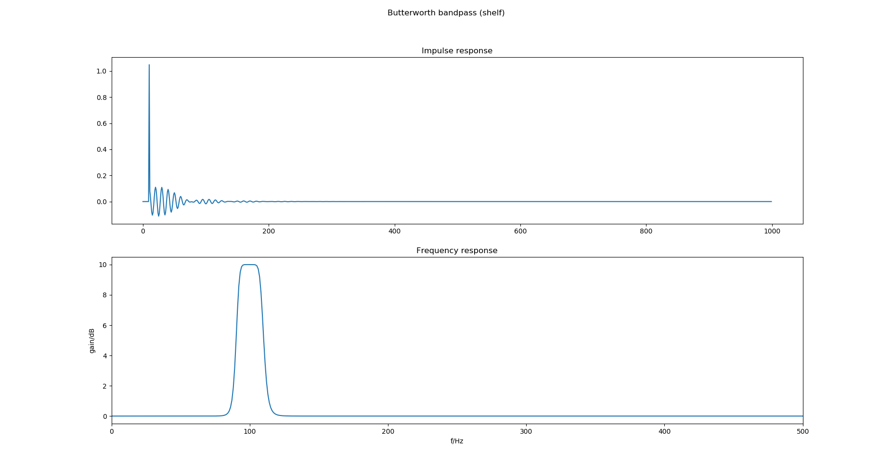
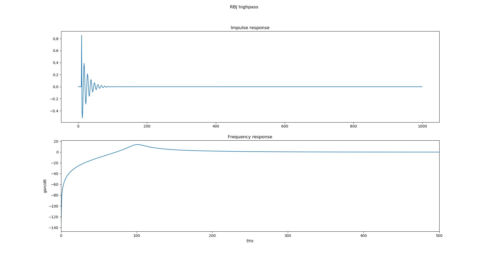
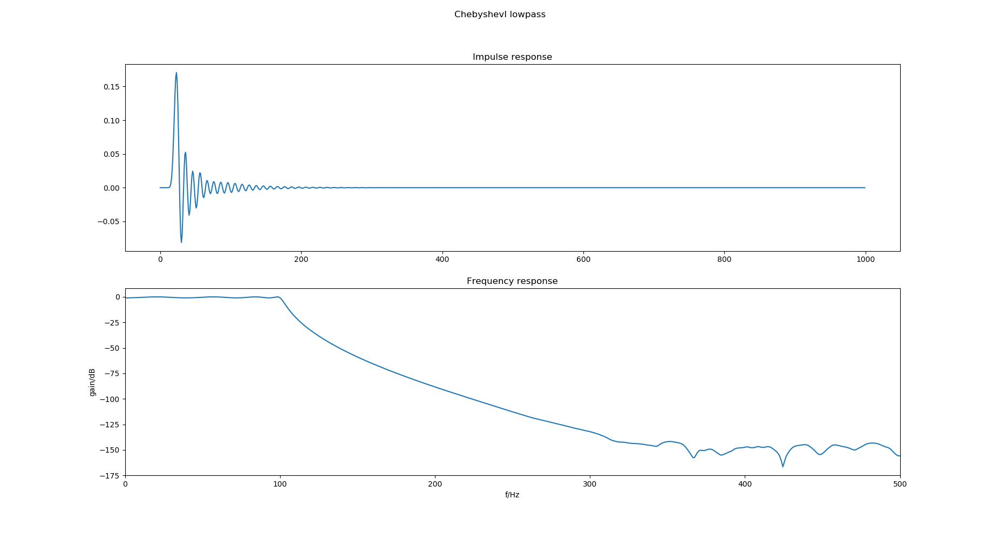
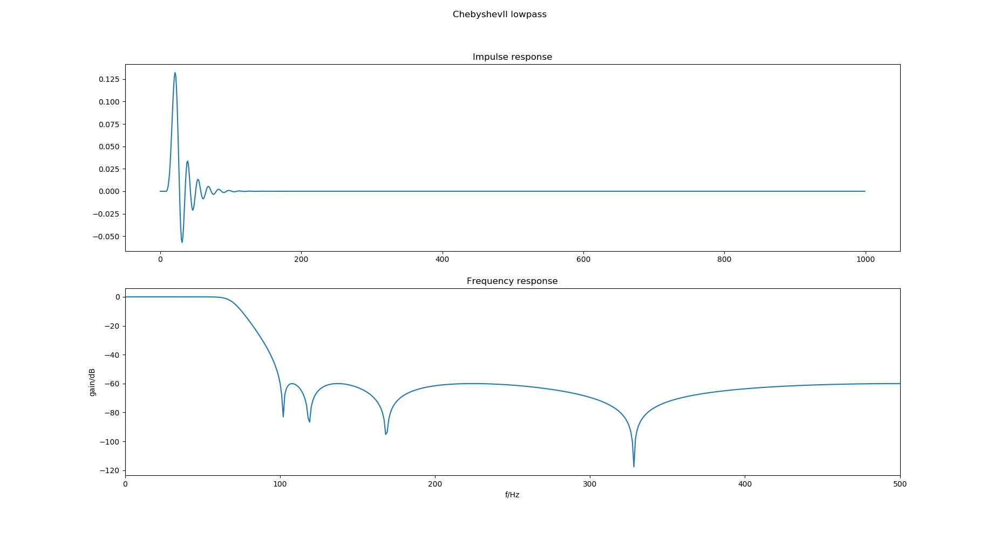
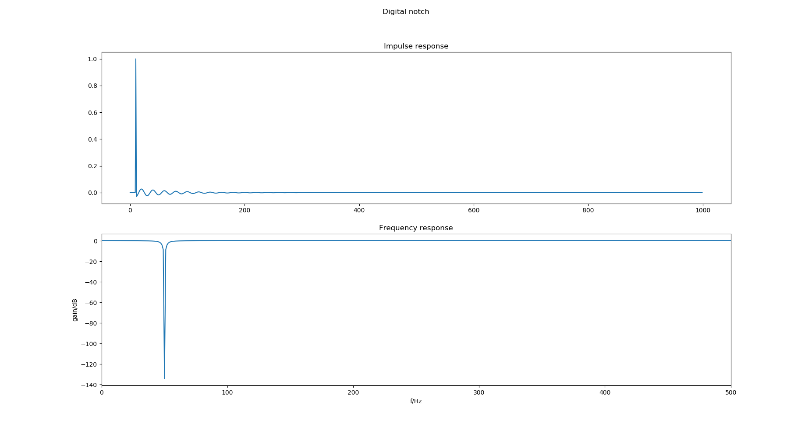
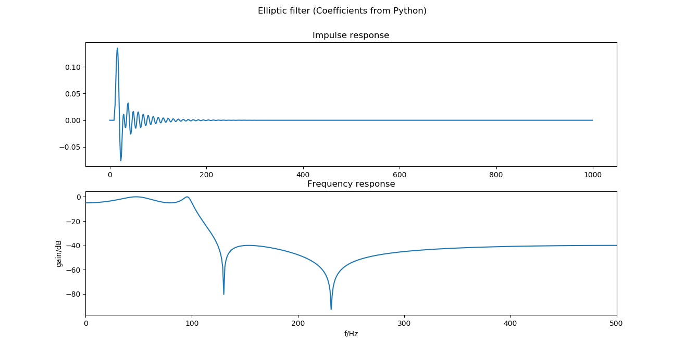

# IIR1 -- Realtime C++ filter library


An infinite impulse response (IIR) filter library for
Linux, Mac OSX and Windows
which implements Bessel, Butterworth, RBJ and Chebychev filters.

The filter processes the data sample by sample for realtime
processing.

It uses templates to allocate the required memory so that
it can run without any malloc / new commands for example
on embedded systems.

## How to use the filter
First the filter is instantiated, then the
parameters are set with the function `setup` and
then it's ready to be used for sample by sample realtime filtering.

### Setting the filter parameters
All filters are available as lowpass, highpass, bandpass and bandstop/notch
filters. Butterworth / Chebyshev offer also low/high/band-shelves with
specified passband gain and 0dB gain in the stopband.

See the header files in `\iir` or the documentation for the arguments
of the `setup` commands.

The examples below are for lowpass filters:

1. Butterworth
```
const int order = 4; // 4th order (=2 biquads)
Iir::Butterworth::LowPass<order> f;
const float samplingrate = 1000; // Hz
const float cutoff_frequency = 5; // Hz
f.setup (samplingrate, cutoff_frequency);
```

2. Chebyshev Type I
```
Iir::ChebyshevI::LowPass<order> f;
const float passband_ripple_in_db = 5;
f.setup (samplingrate,
         cutoff_frequency,
         passband_ripple_in_dB);
```

3. Chebyshev Type II
```
Iir::ChebyshevII::LowPass<order> f;
double stopband_ripple_in_dB = 20;
f.setup (samplingrate,
         cutoff_frequency,
         stopband_ripple_in_dB);
```

4. RBJ (2nd order with cutoff and Q factor)
```
Iir::RBJ::LowPass f;
const float cutoff_frequency = 100;
const float Q_factor = 5;
f.setup (samplingrate, cutoff_frequency, Q_factor);
```


5. Elliptic
```
Iir::Elliptic::LowPass<order> f;
const float pass_ripple_db = 5; // dB
const float rolloff = 0.1;
f.setup (samplingrate,
         cutoff_frequency,
         passband_ripple_db,
         rolloff);
```

### Realtime filtering sample by sample
Samples are processed one by one. In the example below
a sample `x` is processed with the `filter`
command and then saved in `y`. The type of `x` can either be
float or double:
```
float y = f.filter(x);
```
This is then repeated for every incoming sample in a
loop or event handler.

## Packages for Ubuntu (xenial / bionic):

If you have Ubuntu xenial or bionic then
install it as a pre-compiled package:

```
sudo add-apt-repository ppa:berndporr/usbdux
```

It's available for 32,64 bit PC and 32,64 bit ARM (Raspberry PI etc)

## Compilation from source

The build tool is `cmake` which generates the make- or project
files for the different platforms. `cmake` is available for
Linux, Windows and Mac. It also compiles directly on a
Raspberry PI.

### Linux / Mac

Run
```
cmake .
```
which generates the Makefile. Then run:
```
make
sudo make install
```
which installs it under `/usr/local/lib` and `/usr/local/include`.

Both gcc and clang have been tested.

### Windows

```
cmake -G "Visual Studio 15 2017 Win64" .
```

See `cmake` for the different build-options. Above is for a 64 bit build.
Then start Visual C++ and open the solution. This will create
the DLL and the LIB files. Under Windows it's highly recommended
to use the static library and link it into the application program.

### Unit tests

Run unit tests by typing `make test` or just `ctest`.
These test if after a delta pulse all filters relax to zero and
that their outputs never become NaN.

## Documentation

### Overview
For an overview of the class structure and general concepts have a
look at Documentation.txt.

### Learn from the demos
The easiest way to learn is from the examples which are in the `demo`
directory. A delta pulse as a test signal is sent into the different
filters and saved in a file. With the Python script
`plot_impulse_fresponse.py` you can then plot the frequency responses.

Also the directory containing the unit tests provides examples for
every filter type.

### Detailed documentation
A PDF of all classes, methods and in particular `setup` functions
is in the `doc/pdf` directory.

Run `doxygen` to generate the HTML documentation.

## Example filter responses

These are the filter responses generated by `iirdemo.cpp`
in the `demo` directory.










## Credits

This library has been adapted form Vinnie Falco's
original work which can be found here:

https://github.com/vinniefalco/DSPFilters

While his original library processes audio arrays this
library has been adapted to do realtime processing sample
by sample. Also, in contrast to the original library the `setup`
command won't require the filter order.
The filter design routines are identical to
DSPFilters.

Enjoy!

Bernd Porr -- http://www.berndporr.me.uk
