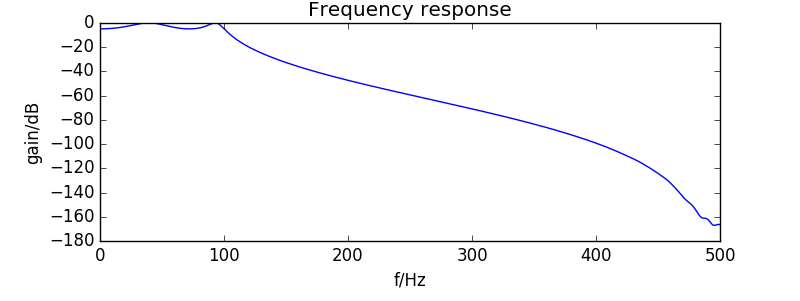

# IIR1



This is a powerful C++ filter library for Linux, Mac OSX
and Windows which implements all standard IIR filters such as
Bessel, Butterworth, Elliptic and Chebychev.

The data format is (double) floating-point throughout.

There is no need to resort to MATLAB/OCTAVE/Python to calculate
the filter coefficients because the library does it
by itself. Just provide the sampling rate, cutoff
frequency, filter order and the filter is
ready to be used. For example for a lowpass:

## Init
```
#define order 4
Iir::Butterworth::LowPass<order> f;
const float samplingrate = 1000; // Hz
const float cutoff_frequency = 5; // Hz
f.setup (order, samplingrate, cutoff_frequency);
```
       
## Realtime filtering sample by sample
```
float y = f.filter(x);
```

## Packages for Ubuntu

If you have Ubuntu xenial, artful or lucid then you can
install it as a pre-compiled package:

```
sudo add-apt-repository ppa:berndporr/usbdux
```

## Compilation from source

The build tool is `cmake` which generates the make- or project
files for the different platforms. `cmake` is available for Linux, Windows
and Mac.

### Linux / Mac

Run
```
cmake -DCMAKE_BUILD_TYPE=Release .
```
which generates the Makefile. Then run:
```
make
sudo make install
```
which installs it under `/usr/local/lib` and `/usr/local/include`.

You can run unit tests with the parameter `make test` or just run `ctest`.

### Windows

```
cmake -G "Visual Studio 15 2017 Win64" .
```

see `cmake` for the different options. Above is for a 64 bit build.
Then start Visual C++ and open the solution. This will create
the DLL and the LIB files.

## Usage / Documentation

Usage is very simple. A demo program is in the `demo` directory which
sets up different filters. A delta pulse is sent into
the filters and saved as a gnuplot/octave file. Also the directory
containing the unit tests contains examples for every filter
type.

For an overview of the class structure and general concepts have a look at Documentation.txt.

Run `doxygen` to generate the documented class hierachy on the basis of
the comments in the header files. The file format is HTML and will be
stored in the `doc` subdirectory.

## Credits

This library has been adapted form Vinnie Falco's
original work which can be found here:
https://github.com/vinniefalco/DSPFilters

Enjoy!

Bernd Porr
